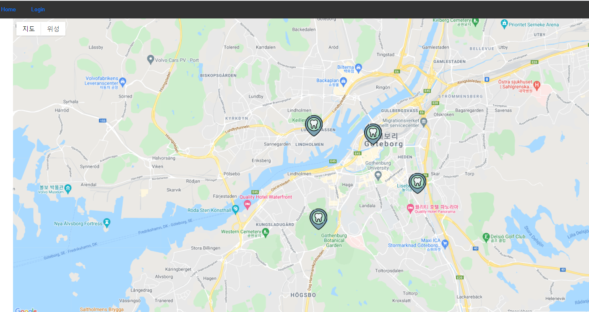

# User Interface

Welcome to the Readme page for the dentismo distributed system. Dentismo is a web application allowing you too book timeslots for dental appointments from several dentists in the Gothenburg area. Dentismo is a distributed system utilizing many components to provide your service.
This component provides the User Interface to the dentismo system ,so to be able to take user input and display a response from server.

## Requirement

In order to run this component, the following program must be installed.

-Node JS 
-Mongoose 
-mosquitto

## Installation

The other components required in Dentismo system can be accessed through this link [Click here]
(https://git.chalmers.se/courses/dit355/test-teams-formation/team-6)

1. open the command line terminal in your IDE.
2. navigate to the location of your repository
3. run the command **npm install**

## Start Application

To run the application from terminal or command prompt:

**npm run serve**

## Teaser

**log in view**

**map view** 
**booking view** 
